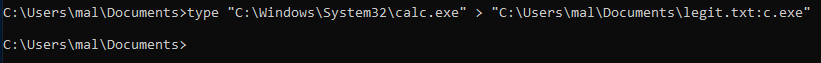
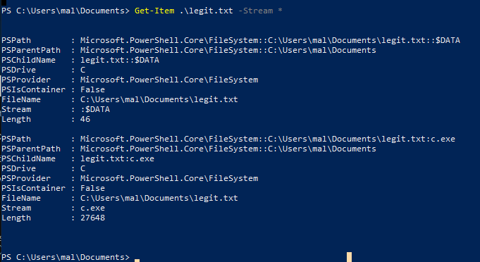
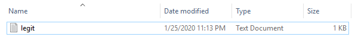
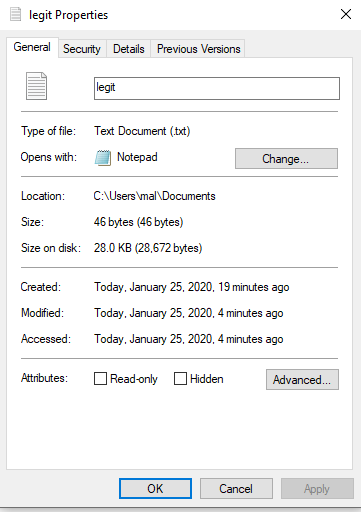
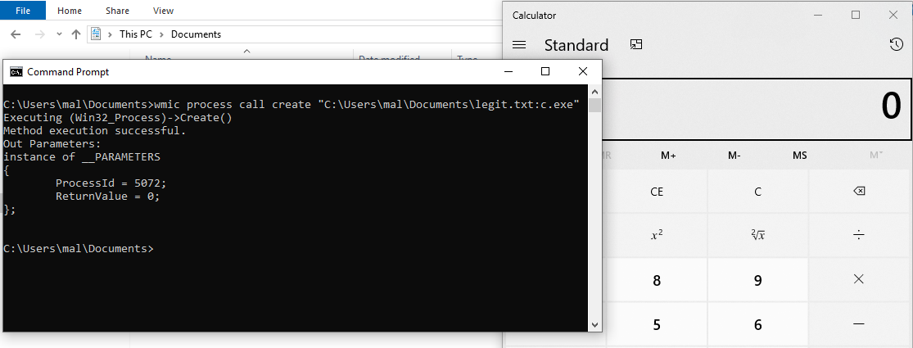
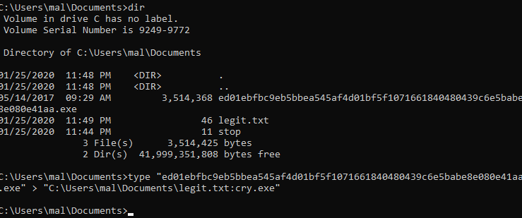
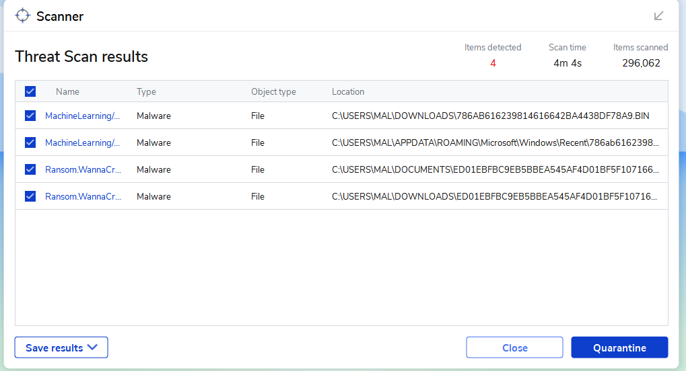
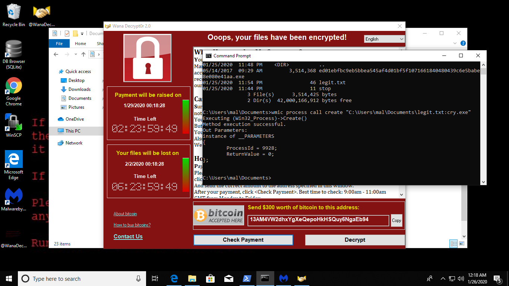

Alternate Data Streams (ADS) are a feature of Windows, more specifically a feature of NTFS. ADS allow (as the name implies) different streams of data to be stored in a file.

## What are Data Streams?  
In order to have an "alternate" data stream, that must mean we have a default stream as well, right? To understand exactly what a stream is, you have to know how NTFS files actually work. I'll explain an extremely small aspect, but the full explanation is out of the scope of this post and I would recommend looking into a resource like [this](https://thestarman.pcministry.com/asm/mbr/IntNTFSfs.htm).  

Files in NTFS have several attributes, one of which is the $DATA attribute, which is the one we care about when discussing ADS. The $DATA attribute holds all the data streams of a file, of which the Default stream is the only one visible by default. Streams are just sequences of bytes, usually holding the data that is actually written to the file. However, through the use of ADS it's possible to put more than just the file's content into one of the $DATA streams.  

This can have some legitimate uses, such as storing the file's origin a.k.a the Zone.Identifier, but as we'll see momentarily it can also be used for malicious purposes.  

## A Basic Example  
Powershell and CMD make interacting with $DATA and ADS pretty ezpz, but there's also tools like [sysinternals streams](https://docs.microsoft.com/en-us/sysinternals/downloads/streams) that can be useful for this sort of thing.  

Let's start by creating a simple text file, `legit.txt`, then examining its data streams.

As we can see, there is only one data stream, and it's the size of the text file we just created. Now we'll copy the Windows Calculator into a new data stream of `legit.txt` then we'll look at the streams again.

{:class="img-responsive"}
{:class="img-responsive"}

We can now see that there's a new ADS located inside `legit.txt` that just so happens to be the exact size of `calc.exe`. Speaking of size, one interesting thing about Windows is that ADS are not counted towards file size, so when browsing from Windows Explorer or the `dir` command, only the size of the default stream is calculated (or simple text file). It's not until you look at "file properties -> size on disk" that you can see the size of the whole file, including all streams.

{:class="img-responsive"}
{:class="img-responsive"}

Now that we've got our executable safely stowed away inside of the text file, lets run it. (Un)fortunately, windows doesn't really allow you to just execute a data stream like a normal executable, but there are [various ways](https://gist.github.com/api0cradle/cdd2d0d0ec9abb686f0e89306e277b8f) to run an ADS, depending on the file type. Here we'll run it with WMIC. As you can see, we pop off a process create and the calculator spins up for us. Perfect!

{:class="img-responsive"}

## Malicious Example 
So now that we've shown how to stash things in these ADS, how can we abuse this for malicious purposes? One benefit is that many AV products struggle to scan a file's ADS and properly analyze the content. To show an example, I've pulled a sample of WannaCry from [theZoo](https://github.com/ytisf/theZoo). CAUTION THAT REPO CONTAINS LOADS OF REAL MALWARE. Lets shove that binary into our text file too. 

{:class="img-responsive"}

Now I'll kick off a Malwarebytes scan, but leaving the raw WannaCry bin a couple of places (as well as another random malware sample from a previous proj), just to make that Malwarebytes isn't totally dumb and will alert on those. 

{:class="img-responsive"}

Once the scan is complete, we can clearly see that it successfully identified the WannaCry sample as well as a couple other pieces of malware, but notice that the `legit.txt` file is not in this list. Now just for fun we'll spin up a wmic process to run the datastream and BOOM our Wanna has been Cried. Proving that there really was malware hiding behind that text file.  

{:class="img-responsive"}

This is by no means an advanced mechanism to hide malware, and several AV products are starting to be better about scanning ADS (there are also various products dedicated to specifically scanning ADS), but for now it's a quick and easy way to stash something in a pinch if you don't have time to pack or otherwise obfuscate.